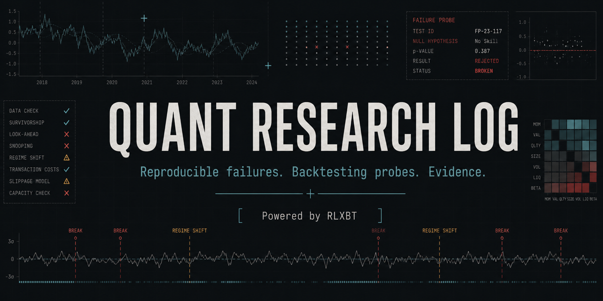

<p align="center">
  
</p>

# Quant research log

A public record of systematic-trading research: what was tested, what died, and
what killed it. Mostly negative results, because most results are negative.

Nothing here is a signal service and nothing here is an invitation to copy a
strategy. The value, if there is any, is in the screens — the tests that a
candidate has to survive, and the order they should be applied in.

**Disclosure:** I build [RLXBT](https://rlxbt.com/?utm_source=github&utm_medium=research_log&utm_campaign=devrel), the backtesting engine used
for this work. Every study states the commands it was produced with so the
result does not depend on trusting either the engine or me.

[Explore the Research Atlas](https://rlxbt.com/research?utm_source=github&utm_medium=research_log&utm_campaign=devrel)
· [Start free](https://rlxbt.com/login?plan=free&utm_source=github&utm_medium=research_log&utm_campaign=devrel)

---

## Why this exists

Published backtests are, correctly, met with suspicion. The reasonable default
assumption about a strategy with a good equity curve is that it is overfit,
survivorship-biased, or costed at zero. I share that assumption about other
people's results and I have no way to argue you out of it about mine.

So this log does not try. It publishes the process instead of the outcome:
the screens, the rejections, and the exact figures at real execution cost.
A reader who disagrees with a conclusion can re-run it and say so.

Five engine defects were found by writing these studies, all of the kind that
report a plausible number rather than failing:

- a backtest was given exit levels the strategy never specified;
- a risk bracket spelled in the wrong format's field names was dropped in
  silence;
- a declared bracket reached only about half of fills under the one execution
  setting that is not a look-ahead;
- one of the two strategy formats could not express a percentage bracket at all,
  so it parsed the risk control and threw it away;
- `position_size` was parsed, stored, read — and never reached the sizing, so
  deploying a quarter of capital returned the same number as deploying all of it.

Fixed in rlx 0.2.9 through 0.2.12, each with regression tests. The studies say
what each was, what it cost, and what the figures looked like before and after.

That is the argument for publishing research rather than only shipping a tool: a
silent failure is one you only meet by using the thing. Study 002 turns them into
seven probes you can run against any engine — and its most useful finding is
about itself. Three releases in a row shipped green against the suite as it stood
that day, and each failed a probe added afterwards. Every one of those probes was
written *after* the defect had been found by other means. The suite has never
caught a defect before a release; it has only stopped one from coming back. Runs
against 0.2.9, 0.2.10, 0.2.11 and 0.2.12 are all in the repo, failures included.

## What the record currently says

No strategy in this project beats buy-and-hold. The one construction that
achieved genuine market neutrality earns a fraction of a percent per year once
a single exceptional year is removed. That is the honest summary, and it has
not changed in the direction I hoped.

The useful part is *why* each thing died, because the binding constraint moved
three times, and knowing which constraint binds is worth more than any
individual result.

## Studies

| # | Study | Finding |
|---|---|---|
| [011](studies/011-wrong-hypothesis/) | When a backtest tests the opposite hypothesis | A pre-event precursor inherited direction from a post-event response, so the execution interval and label interval disagreed. A deterministic synthetic fixture makes the sign inversion explicit and shows why invalid metrics must be quarantined. |
| [010](studies/010-predictive-not-tradable/) | Predictive feature does not imply tradable threshold | Four of five strict nonlinear leads failed bounded threshold conversion. The strongest raw score, 0.668, produced a strategy-probe Sharpe of only 0.168; the one conversion required structural re-encoding. |
| [009](studies/009-cost-survival/) | Clearing costs is not out-of-sample validation | 53 of 196 eligible configurations cleared commission, but none of the five breakeven-fee leaders passed WFE, majority-positive OOS, and Monte Carlo lower-tail gates together. |
| [008](studies/008-state-sequence/) | Does an ordered market-state chain add value beyond its final state? | `volume expansion → buy pressure → failed breakout` lost money in discovery and validation. The untouched final point estimate was +3.47 bps/event, but its interval was [-14.92, +22.09] and its incremental advantage over failure-only events was unresolved. |
| [007](studies/007-impulse-revisit/) | Does a bullish impulse become support on first revisit? | No under the fixed definition. On 60,000 BTC 1h bars, both the range-only and volume-confirmed variants had negative net expectancy in all three chronological periods; final results were -11.37 and -11.02 bps/event. |
| [006](studies/006-four-failed-ideas/) | Four plausible ideas that failed after costs | Selective ML, order-book magnitude, lagged macro data, and Bitcoin network state all looked statistically useful somewhere and all finished with negative net expectancy. The reusable lessons are about precision, direction, baselines, and clock speed. |
| [005](studies/005-screens/) | Ranking candidates by the number that cannot be gamed | Rank 96 backtests by return and by breakeven fee. Within one rule family the orderings agree (Spearman +0.91); across structurally different rules they do not (+0.61, one of five shared), and the highest-returning candidate on the grid — **+725.59% gross** — is dead at real cost. Plus the four screens a private programme ended up with, and the failure that produced each. |
| [004](studies/004-pattern-noise/) | What a pattern miner finds in data with no patterns | Shuffled returns — same distribution, no time structure — produced 13–18 candidates "confirmed by temporal holdout" against 17 from real BTC. That phrase carries no information. The promotion gate downstream rejected 45 of 45 noise candidates, bounding its false-positive rate at 6.7%; but it promoted only 1 of 17 real ones, so whether it *discriminates* is not established (Fisher p = 0.274). A filter that rejects almost everything will reject noise. |
| [003](studies/003-cost-screen/) | Reading a published strategy table | Which rows of someone else's results are already dead at real cost, from numbers the table already reports: `ln(1+R) / (2 × trades × position_size)`. Generalises study 001's identity to fractional sizing — the correction is exactly `1/size`, measured to within 0.31%. Then finds the wall: for a strategy of several independently-capitalised sleeves the screen fails and **no aggregate substitution rescues it**, because sleeve returns combine arithmetically while their cost tolerances live in logs. A blended return and a total trade count do not contain the answer. |
| [002](studies/002-silent-failures/) | Seven probes for a backtest that lies quietly | Ask the engine questions whose answers you already know. Seven trivial checks that between them caught five real defects — costs not applied, exits invented, a declared bracket missing from half the fills, a bracket one input format discarded, a sizing field that changed nothing, and a validator that accepts `{}`. Runs against any engine. Reports FAIL on three of my own released versions, and the finding is that each of those releases was green when it shipped. |
| [001](studies/001-execution-costs/) | What sets tolerance for execution cost | A strategy's breakeven fee is `ln(1+gross_return) / (2 × trades)`. Take-profit and timeframe matter only through those two numbers — so "use a higher timeframe" is not advice, and you never need to search for a breakeven fee. |

Each study directory contains the question, the method, the figures, the
caveats, and a `run.sh` that reproduces them from data bundled in the repo.
If a study's `run.sh` does not reproduce its own numbers, that is a bug and an
issue is welcome.

## Reproducing

The engine is public two ways: the macOS app from [rlxbt.com](https://rlxbt.com/?utm_source=github&utm_medium=research_log&utm_campaign=devrel),
and the headless server image `ghcr.io/sergio12s/rlxbt-server` with the compose
file at
[rlxbt.com/downloads](https://rlxbt.com/downloads/rlxbt-server-compose.yml?utm_source=github&utm_medium=research_log&utm_campaign=devrel).

**Use 0.2.12 or later.** Two settings these studies depend on — the signal
execution timing, and whether a synthetic take-profit and stop-loss are overlaid
on strategies that declare none — reached the HTTP API only in 0.2.10. Before
that they were flags on a binary that is not published, which meant nobody but
me could re-derive these tables. Now `POST /api/load-data` takes both:

```json
{
  "path": "/var/lib/rlxbt/datasets/btc_1h_feat.csv",
  "commission": 0.0,
  "signal_execution_timing": "next_open",
  "dynamic_tp_sl": false
}
```

Those are the settings every study here uses, and the defaults are not them:
execution defaults to same-bar, which lets a signal trade on the bar that
produced it.

Earlier engines will also produce different numbers for a second reason: up to
0.2.9 roughly half of these trades ran with no take-profit or stop-loss at all
despite the strategy declaring both. Study 001 explains what that was.

Studies 001 and 002 write their strategies in the graph format (`entry_rules`,
with `take_profit_pct`), which is why their tables are unaffected by the defect
0.2.11 fixed: on 0.2.10 and earlier the *simple* format silently discarded a
percentage bracket. Study 001's table reproduces byte-for-byte from 0.2.10
onward. If you port a study to the simple format, use 0.2.11 or later.

**Study 003 needs 0.2.12 specifically.** It measures the position-size term in
the breakeven identity, and before 0.2.12 the engine ignored `position_size`
entirely — every sizing produced identical numbers, so the correction it reports
could not be observed at all.

```bash
git clone https://github.com/sergio12S/quant-research-log
cd quant-research-log/studies/001-execution-costs
./run.sh /path/to/engine
```

The bundled runners drive the engine binary. Against the server image the same
experiment is a `load-data` call per cost level and a `run-backtest` per
strategy — the study states every parameter it sets, so porting it is
mechanical.

The bundled datasets are small on purpose — enough to reproduce the studies,
not enough to do your own research with. Bring your own data for that; the
engine loads any OHLCV CSV by path.

## What is deliberately not here

- Anything currently traded with real money.
- The feature set and universe selection that constitute whatever edge exists.
- Live execution code, positions, or account state.

This is a curated extract from a private working repository. The flow is one
way, by hand, and a commit hook refuses anything matching the private
project's internal markers. See [PORTING.md](PORTING.md).

## Conventions

Figures are **commission-only** unless stated. Slippage is not modelled, so
every number here is optimistic — which matters most for the results that look
worst, since they are worse still.

Costs are quoted as **basis points per side**. The live cost used throughout is
4.404 bps/side; where a study uses a different figure it says so in the first
paragraph.
